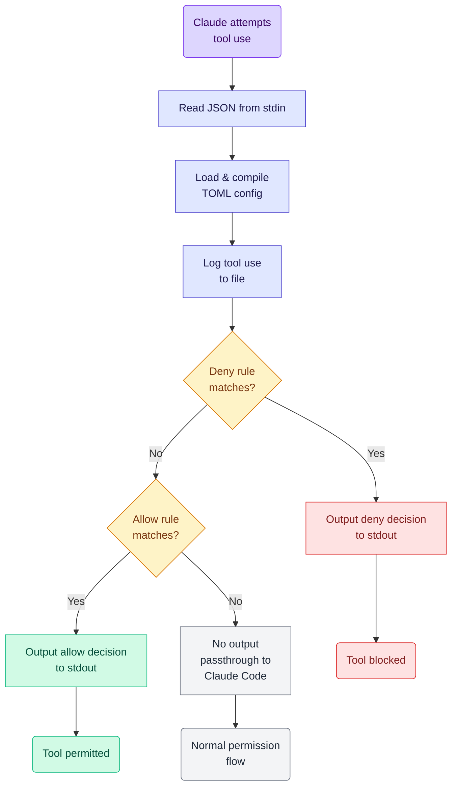

# Command Permissions Hook for Claude Code

A PreToolUse hook for Claude Code that provides granular control over which tools Claude can use, with support for allow/deny rules, pattern matching, and security exclusions.

NOTE: This is a workaround for current (December 2025) limitations in Claude Code permissions - [setting Bash permissions](https://docs.claude.com/en/docs/claude-code/iam#tool-specific-permission-rules) doesn't work consistently. Built following Anthropic's [hook guidelines](https://docs.claude.com/en/docs/claude-code/iam#additional-permission-control-with-hooks).

This may be short-lived as Anthropic improves permissions. Use it if it helps, but you'll need basic Rust knowledge.

## Features

- All configuration is via a single `.toml` file - see [example.toml](./example.toml) for an example
- Allow/deny rules with regex pattern matching for tool inputs
- Exclude patterns for handling edge cases (e.g., block `..` in allowed paths)
- Audit logging of tool use decisions to JSON file

## Documentation

- **[Configuration Guide](./docs/configuration-guide.md)** - How to write rules for each supported tool
- **[Tool Input Schemas](./docs/tool-input-schemas.md)** - Reference for Claude Code tool input formats

## Installation

Requires Rust. Install via [rustup](https://rustup.rs/) if you want to use this project. Rust is fun!

```bash
cargo build --release
```

Binary: `target/release/claude-code-permissions-hook`

## Configuration

Create a TOML configuration file (see `example.toml`):

```toml
[audit]
audit_file = "/tmp/claude-tool-use.json"
# Audit level: off, matched (default), all
# - off: no auditing
# - matched: audit only tool use that hits a rule (allow/deny)
# - all: audit everything including passthrough
audit_level = "matched"

# Allow rules - checked after deny rules
[[allow]]
tool = "Read"
file_path_regex = "^/Users/korny/Dropbox/prj/.*"
file_path_exclude_regex = "\\.\\."  # Block path traversal

[[allow]]
tool = "Bash"
command_regex = "^cargo (build|test|check|clippy|fmt|run)"
command_exclude_regex = "&|;|\\||`|\\$\\("  # Block shell injection

[[allow]]
tool = "Task"
subagent_type = "codebase-analyzer"

# Deny rules - checked first (take precedence)
[[deny]]
tool = "Bash"
command_regex = "^rm .*-rf"

[[deny]]
tool = "Read"
file_path_regex = "\\.(env|secret)$"
```

## Claude Code Setup

Add to `.claude/settings.json`:

```json
{
  "hooks": {
    "PreToolUse": [
      {
        "matcher": "*",
        "hooks": [
          {
            "type": "command",
            "command": "/path/to/claude-code-permissions-hook run --config ~/.config/claude-code-permissions-hook.toml"
          }
        ]
      }
    ]
  }
}
```

## Usage

### Validate Configuration

```bash
cargo run -- validate --config example.toml
```

### Run as Hook (reads JSON from stdin)

```bash
echo '<hook-input-json>' | cargo run -- run --config example.toml
```

### Run Tests

```bash
cargo test
```

See `tests/` directory for integration tests and sample JSON inputs.

## How It Works



Deny rules are checked first (block), then allow rules (permit). No match = passthrough to normal Claude Code permissions.

See the [Configuration Guide](./docs/configuration-guide.md) for detailed rule syntax and security patterns.

## Development

```bash
cargo test      # Run tests
cargo clippy    # Lint code
cargo fmt       # Format code
```

## Logging

**Audit file** (JSON): Records tool use to `audit_file`. Set `audit_level` to `off`, `matched` (default), or `all`.

**Diagnostic log** (stderr): Set `RUST_LOG=debug` for rule matching debug output.

## License

See LICENSE file for details.
