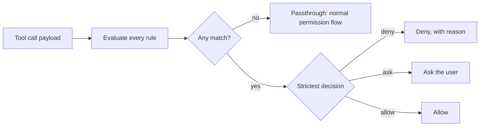

# tool-gate-hook

A `PreToolUse` hook for **Claude Code** and **GitHub Copilot CLI** (macOS, local CLI only) that does two jobs:

1. **Gate**: auto-allow, auto-deny, or force a prompt (`ask`) for tool calls, using rules you write in a TOML file. Anything no rule matches passes through to the agent's normal permission flow.
2. **Observe**: record every call to a JSONL audit log with the raw payload, which rules matched, in order, and which one decided. When an agent changes what it sends, the log shows you.

Both agents use the same rule engine; only the payload shape and tool names differ.

This is a workaround for the limits of the agents' built-in permission rules (for example, Bash permissions that don't hold up against `a && b`). It is small and rule-driven, and you need Rust to build it.

> **This has changed since I blogged about it.** It was `claude-code-permissions-hook`, a Claude-only hook with `[[allow]]` / `[[deny]]` rules; it has since been renamed, given a new config format and taught to work with Copilot CLI. To see the code as it was when the blog post was written, browse [the repository at that commit](https://github.com/kornysietsma/claude-code-permissions-hook/tree/ca0dca0588319ca12bc03b0dc0d6bd4f3e563b75).

## Install

Requires Rust ([rustup](https://rustup.rs/)).

```bash
cargo install --path .
```

This puts `tool-gate-hook` in `~/.cargo/bin`. **Agents may run hooks with a `PATH` that doesn't include `~/.cargo/bin`**; if the hook doesn't fire, use the absolute path (e.g. `/Users/you/.cargo/bin/tool-gate-hook`) in the registration commands below.

## Quick start

Copy an example config to the default location for your agent and edit it:

| | Claude Code | Copilot CLI |
|---|---|---|
| Example | [`examples/claude.toml`](./examples/claude.toml) | [`examples/copilot.toml`](./examples/copilot.toml) |
| Default config | `~/.config/tool-gate-hook/claude.toml` | `~/.config/tool-gate-hook/copilot.toml` |
| Registration | `~/.claude/settings.json` | `~/.copilot/hooks/tool-gate-hook.json` |

```bash
mkdir -p ~/.config/tool-gate-hook
cp examples/claude.toml ~/.config/tool-gate-hook/claude.toml
tool-gate-hook validate --agent claude
```

`--agent` is required (there is no auto-detection) and `--config PATH` overrides the default location.

A minimal config:

```toml
[audit]
file = "/tmp/tool-gate-hook-claude.jsonl"

[patterns]
shell_chain = ';|\||`|&&|&[^0-9]|&$|\$\('

[[rule]]
decision = "allow"
tool = "Bash"
description = "cargo workflow"
match."tool_input.command" = { regex = '^cargo (build|test|check)\b', not_regex = "@shell_chain" }

[[rule]]
decision = "deny"
tool = "Read"
description = "secrets files"
reason = "Secrets files are off limits"
match."tool_input.file_path" = { regex = '\.(env|secret)$' }
```

See the [Configuration guide](./docs/configuration-guide.md) for every option.

## Registering the hook

### User level (typical)

Claude Code, in `~/.claude/settings.json`:

```json
{
  "hooks": {
    "PreToolUse": [
      {
        "matcher": "*",
        "hooks": [
          { "type": "command", "command": "tool-gate-hook run --agent claude" }
        ]
      }
    ]
  }
}
```

Copilot CLI, in `~/.copilot/hooks/tool-gate-hook.json`:

```json
{
  "version": 1,
  "hooks": {
    "preToolUse": [
      { "type": "command", "bash": "tool-gate-hook run --agent copilot", "timeoutSec": 10 }
    ]
  }
}
```

### Project level (opt-in)

For a project with its own needs, register a second hook with its own config file kept in the project. The agents run all matching hooks and combine them most-restrictive-wins, so no merging happens in this tool.

- **Claude**: in `.claude/settings.json`, use the command
  `tool-gate-hook run --agent claude --config "$CLAUDE_PROJECT_DIR/.claude/tool-gate-hook.toml"`.
- **Copilot**: in `.github/hooks/tool-gate-hook.json`, use
  `tool-gate-hook run --agent copilot --config .github/hooks/tool-gate-hook.toml`. Repo-level hooks run in the repository root, so the relative `--config` path works (a relative path resolves against the process's working directory).

Each config names its own audit file. Pointing both at the same file is safe (lines are written under a file lock), and the `config` field in each record says which config wrote it.

## How decisions are made


```mermaid
flowchart LR
    A[Tool call payload] --> B[Evaluate every rule]
    B --> C{Any match?}
    C -- no --> P[Passthrough: normal permission flow]
    C -- yes --> D{Strictest decision}
    D -- deny --> X[Deny, with reason]
    D -- ask --> Y[Ask the user]
    D -- allow --> Z[Allow]
```

Every rule is evaluated; the final decision is **deny > ask > allow** regardless of order, and no match means passthrough. Shell chaining isn't parsed: allow rules carry a `not_regex = "@shell_chain"` safety net, so a chained command makes the rule not match and falls through to you.

## Errors

`tool-gate-hook run` always exits 0 (Copilot treats any non-zero exit as a deny).

- **Config problem** (missing file, bad TOML, invalid regex): every call gets an `ask` with the error as the reason, plus a message on stderr. Loud, never locked out.
- **Payload for the wrong agent or malformed**: passthrough with a stderr warning, and an error record in the audit log. This is what happens if a `--agent copilot` hook is registered in `.claude/settings.json`, which Copilot also reads. Register Copilot hooks under `.github/hooks/` or `~/.copilot/hooks/` instead; see [Copilot payloads](./docs/copilot-tool-inputs.md) for what Copilot sends to a `.claude` hook.
- **Audit write failure**: stderr warning only.

## Troubleshooting

- **Nothing happens**: check the hook is registered, then run it by hand: `cat tests/fixtures/claude/bash.json | tool-gate-hook run --agent claude`. No output means passthrough.
- **`command not found` in the agent**: use the absolute path to the binary (see Install).
- **Every call asks with "config error"**: run `tool-gate-hook validate --agent claude` to see the error.
- **A rule never matches**: `validate` warns when a field path doesn't start with a payload key known for the agent (for example `toolArgs.path` in a Claude config). Set `level = "all"` and `max_value_len = 0` in `[audit]` and look at the real payloads in the log.

## Status

Both agents have been checked on a real install (2026-10-04): payloads captured, and `allow`, `deny`, `ask` and config-error behaviour seen in the UI. Things to know about Copilot CLI:

- Copilot picks its tools per model. Haiku 4.5 created files with `create` (`toolArgs.path`, `file_text`), while a GPT model used `apply_patch`, whose `toolArgs` is the patch text as a plain string: gate it with a regex on `toolArgs`, not a path. Write rules for both. `grep` arrives as `rg`, and `glob` and `rg` carry their directory in `toolArgs.paths`.
- Copilot also runs hooks from `.claude/settings.json`, sending Claude-format payloads with Claude's tool names (`Read`, `Edit`, ...) but Copilot's field names (`tool_input.path`). If you use Copilot, configure it to ignore `.claude/` files.
- A deny from one hook can stop other hooks running for that call, so a repo-level audit log may miss calls that a user-level hook denied.
- Not tested: `edit` (never seen), whether Copilot honours Claude-format decisions from a `.claude` hook, and whether it reads the user-level `~/.claude/settings.json`.

The details are in [Copilot payloads](./docs/copilot-tool-inputs.md).

## Documentation

- [Configuration guide](./docs/configuration-guide.md): the full config reference
- [Claude payloads](./docs/claude-tool-inputs.md) and [Copilot payloads](./docs/copilot-tool-inputs.md): what the agents send, i.e. what rules can match
- [`examples/`](./examples): ready-to-copy configs, including an illustrative Mermaid workflow
- [Copilot verification](./docs/copilot-verification.md): how Copilot CLI was checked on a real install, repeatable for a new Copilot version
- [Review findings](./docs/review-findings.md): the reviews before and after the rework from `claude-code-permissions-hook`

## Development

```bash
cargo fmt --check && cargo clippy --all-targets -- -D warnings && cargo test
```

See [tests/README.md](./tests/README.md) for the test layout and how to capture real payloads into fixtures.

## License

MIT; see [LICENSE](./LICENSE).
