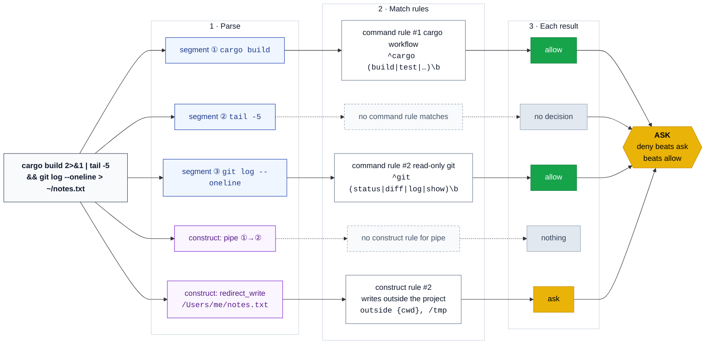

# Configuration guide

The full reference for a `tool-gate-hook` config file. For a quick start see the [README](../README.md); for ready-to-copy configs see [`examples/`](../examples/).

**Contents**

- [Overview](#overview)
- [Writing regexes in TOML](#writing-regexes-in-toml)
- [`[audit]`](#audit)
- [`[patterns]`](#patterns)
- [`[[rule]]`](#rule)
  - [Field paths](#field-paths)
- [Matchers](#matchers)
  - [Pattern references and `@`](#pattern-references-and-)
  - [`under`](#under)
- [Shell commands](#shell-commands)
  - [Segments](#segments)
  - [What can't be allowed: floors](#what-cant-be-allowed-floors)
  - [`[[command_rule]]`](#command_rule)
  - [`[[construct_rule]]`](#construct_rule)
  - [`[shell]`](#shell)
  - [Wrappers](#wrappers)
  - [`cd`](#cd)
  - [zsh](#zsh)
  - [Known gaps](#known-gaps)
- [How decisions are made](#how-decisions-are-made)
  - [Reasons](#reasons)
- [`explain`](#explain)
- [Errors and failure behaviour](#errors-and-failure-behaviour)
- [Audit log](#audit-log)
- [Worked examples](#worked-examples)
  - [How one shell command is judged](#how-one-shell-command-is-judged)
  - [Claude: allow a workflow, ask on risky structure](#claude-allow-a-workflow-ask-on-risky-structure)
  - [Claude: limit writes to a directory, and deny secrets](#claude-limit-writes-to-a-directory-and-deny-secrets)
  - [Copilot: the same idea](#copilot-the-same-idea)
  - [Only ask in subagents](#only-ask-in-subagents)
  - [A whole workflow](#a-whole-workflow)
- [Registering the hook](#registering-the-hook)

## Overview

A config is a TOML file with these parts, all optional:

| Part | What it does |
|------|--------------|
| `[audit]` | Where and how much to log |
| `[patterns]` | Named regexes, reusable in rules |
| `[shell]` | Settings for shell commands (`safe_env`) |
| `[[rule]]` | Rules on the raw tool call payload, for any tool |
| `[[command_rule]]` | Rules on each command inside a shell command (`Bash` / `bash`) |
| `[[construct_rule]]` | Rules on shell structure: redirects, backgrounding, pipes, … |

Every config is for **one agent** (`--agent claude` or `--agent copilot`); write one file per agent.

Check a config with:

```bash
tool-gate-hook validate --agent claude --config path/to/claude.toml
```

`validate` exits non-zero on any error and prints a summary (rule counts per kind and decision, construct rules, `safe_env`, pattern names, audit settings). It also **warns** (exit 0) when a `[[rule]]` field path doesn't start with a payload key known for that agent, which catches rules copied between agents, and when a `[[command_rule]]` field path doesn't start with a [segment field](#segments).

To see how a command would be judged, and why, use [`explain`](#explain).

## Writing regexes in TOML

Write regexes as **single-quoted literal strings**, which need no backslash doubling:

```toml
regex = '^cargo (build|test)\b'     # good
regex = "^cargo (build|test)\\b"    # same thing, harder to read
```

## `[audit]`

```toml
[audit]
file = "/tmp/tool-gate-hook-claude.jsonl"
level = "matched"        # off | matched | all
max_value_len = 1024     # 0 = never truncate
```

Leaving it out disables auditing. When present, `file` is required (its directory must already exist), `level` defaults to `matched` and `max_value_len` to `1024`.

| `level` | Records |
|---------|---------|
| `off` | nothing |
| `matched` | calls where at least one rule (or, for shell commands, a [floor](#what-cant-be-allowed-floors)) matched, plus all error records |
| `all` | every call, including passthroughs |

See [Audit log](#audit-log) for the record format.

## `[patterns]`

Named regexes, reusable in `regex`, `not_regex` and `[shell] safe_env`, in every kind of rule:

```toml
[patterns]
secrets = '\.(env|secret|pem)$'
```

A rule then uses it as `regex = '@secrets'` (see [Pattern references](#pattern-references-and-)).

Patterns belong to the config file that defines them. Every pattern is compiled when the config loads, so a broken one is an error even if no rule uses it.

## `[[rule]]`

Rules on the raw payload of any tool call:

```toml
[[rule]]
decision = "deny"                        # required: allow | deny | ask
tool = "Read|Edit|Write"                 # optional: regex on the tool name
description = "secrets files"            # optional: shown in logs and default reasons
reason = "Secrets files are off limits"  # optional: what the agent is told
match."tool_input.file_path" = { regex = '\.(env|secret|pem)$' }
```

| Key | Meaning |
|-----|---------|
| `decision` | Required. `allow`, `deny` or `ask`. |
| `tool` | A regex, **anchored** as `^(?:…)$` against the tool name, so `Read` doesn't match `ReadFile`. Use `Read\|Write` for either. Omit it to match any tool. Claude's names are capitalised (`Bash`), Copilot's lowercase (`bash`); matching is case-sensitive. |
| `description` | Free text used in audit records, validate warnings and default reasons. |
| `reason` | Returned to the agent as the decision reason. Default: `tool-gate-hook: <decision> by rule #<index>` plus ` (<description>)` when there is one. |
| `match` | A table keyed by dotted field path. All entries must pass (**AND**); for OR, write separate rules. A rule with no `match` entries matches on `tool` alone. |

Unknown keys anywhere in a rule are errors, so a typo like `comand` can't silently disable a rule.

**The shell tool is different.** A `[[rule]]` can deny or ask for the shell tool (`Bash` for Claude, `bash` for Copilot), for example on `permission_mode` or `agent_id`, but it **can't allow** it: an allow `[[rule]]` whose `tool` matches the shell tool, or that has no `tool`, is a config error. Shell commands are allowed with [`[[command_rule]]`](#command_rule).

### Field paths

Each `match` key is a dotted path into the **raw payload** the agent sends, so any field can be matched: `tool_input.file_path`, `toolArgs.path`, `cwd`, `permission_mode`, `agent_type`, and so on. See [Claude payloads](./claude-tool-inputs.md) and [Copilot payloads](./copilot-tool-inputs.md).

- A path walks objects by key. A **missing** path makes the matcher fail (the rule doesn't match), except for `exists = false`.
- Strings are matched as they are. Numbers and booleans are matched against their JSON text (`120000`, `true`). `null`, arrays and objects only work with `exists`.
- Quote the path in TOML: `match."tool_input.file_path" = { … }`.

## Matchers

Each field takes a table of matchers. **All matchers given must pass.** The same matchers work in `[[rule]]` and `[[command_rule]]`.

| Matcher | Value | Passes when |
|---------|-------|-------------|
| `regex` | string or list | The value matches (an unanchored search: write `^` and `$` yourself). With a list, **any** item matching is enough. |
| `not_regex` | string or list | **No** item matches. An excluded call makes the rule *not match*; it does not become a deny. |
| `equals` | string | The value is exactly this string. |
| `glob` | string | The value matches this glob, e.g. `**/*.rs`. Path-style: `*` does not cross `/`, `**` does. For simple path checks; use `regex` for commands. |
| `under` | list of strings | The value is a path inside any listed directory (see [`under`](#under)). |
| `exists` | bool | The field is present (`true`) or absent (`false`). The only matcher that can pass on a missing field. |

An empty matcher table (`match."x" = {}`) or an empty list (`regex = []`) is a config error.

```toml
# Either extension
match."tool_input.file_path" = { regex = ['\.md$', '\.txt$'] }

# Only subagent calls (agent_id is absent for the main agent)
match."agent_id" = { exists = true }
```

### Pattern references and `@`

A list item (or string) starting with `@` is always a **pattern reference** to `[patterns]`. An unknown name is a config error. A regex that genuinely starts with a literal `@` must be written `\@` or `[@]`:

```toml
regex = '\@mention'     # a literal @
regex = '[@]mention'    # also fine
regex = '@mention'      # error: unknown pattern @mention
```

### `under`

`under` checks that a path lies inside one of the listed directories:

```toml
match."tool_input.file_path" = { under = ["{cwd}", "~/notes", "/tmp/mermaid"] }
```

- In the listed directories, `~` (alone or before `/`) is the home directory and `{cwd}` is the payload's `cwd`.
- A relative value is resolved against the payload's `cwd` (for a shell command after a `cd`, against [every directory the shell might be in](#cd)).
- The path is **resolved the way the OS would**: the longest existing prefix is canonicalised (following symlinks, applying `..`), and only the not-yet-existing remainder is cleaned up textually, so a `Write` to a new file works. A symlink inside an allowed directory that points outside it does not escape the check, and `/tmp/mermaid/../secret` is not under `/tmp/mermaid`.
- Containment is by path component: `/tmp/mermaid2` is not under `/tmp/mermaid`.
- The listed directories are canonicalised the same way (so `/tmp` and macOS's `/private/tmp` agree).

Prefer `under` to a regex for path checks.

## Shell commands

Calls to the shell tool (`Bash` for Claude, `bash` for Copilot) are not matched as one string. The command is **parsed** with a bash grammar, split into **segments** (simple commands), and checked like this:

- every segment is checked against the [`[[command_rule]]`s](#command_rule);
- the shell structure (redirects, `&`, pipes, …) is checked against the [`[[construct_rule]]`s](#construct_rule);
- anything that can't be checked statically hits a built-in [**floor**](#what-cant-be-allowed-floors), which stops the command being allowed.

A shell call is **allowed only when every segment is allowed** by a command rule and nothing asks or denies. So `cargo build 2>&1 && cargo test` is allowed when cargo is, `cargo test && curl evil.example` is not (unless `curl` is allowed too), and quoted text such as a heredoc or a commit message is data, never a command. For a diagram of one command going through these steps, see [How one shell command is judged](#how-one-shell-command-is-judged).

Claude Code runs commands in your login shell (zsh on macOS) and Copilot in bash. The parser uses bash syntax; where zsh would read a command differently, the command hits a floor (see [zsh](#zsh)).

### Segments

A segment is one simple command, found anywhere in the command: in lists (`;`, `&&`, `||`, newlines), pipelines, subshells `( … )`, brace groups `{ …; }`, and inside command substitutions `$( … )`, backticks and process substitutions `<( … )` / `>( … )`. Control structures (`if`, `for`, `while`, `case`, functions) aren't supported yet and ask.

Rules see each segment as a JSON object:

```json
{
  "text": "./scripts/thing.sh --out 'my file.txt'",
  "name": "./scripts/thing.sh",
  "args": ["--out", "my file.txt"],
  "env": { "RUST_LOG": "debug" },
  "redirects": [ { "op": ">&", "fd": 2, "target": "1" }, { "op": ">", "target": "log.txt" } ],
  "wrappers": ["timeout"],
  "source": "RUST_LOG=debug timeout 60 ./scripts/thing.sh --out \"my file.txt\" 2>& 1 > log.txt"
}
```

| Field | Meaning |
|-------|---------|
| `text` | **What rules usually match.** `name` and `args` joined by spaces, each quoted only if needed (plain if it is only `A-Za-z0-9_@%+=:,./-`, else single-quoted). No env, redirects or wrappers, so `^` means "start of this command". |
| `name` | The command word, unquoted, after [unwrapping](#wrappers) `env`, `timeout` and the like. A leading `~` is expanded. |
| `args` | The arguments, unquoted and split as the shell would. A leading `~` / `~/` is expanded. |
| `env` | Assignments in front of the command (`FOO=1 cmd`) or given to `env`. |
| `redirects` | Each redirect's `op`, optional `fd`, and `target` (for heredocs, the delimiter). Redirects on a `( … )` or `{ …; }` group are copied onto every segment inside it. |
| `wrappers` | The wrappers that were unwrapped, in order. |
| `source` | The segment as the parser renders it, for the audit log. Normalised: `2>&1` becomes `2>& 1`. |
| `dirs` | Every directory the shell might be in when the segment runs; only shown after a `cd`. |

Write rules on `text` (for a command and its arguments) or `name` (for the command alone). The other fields can be matched by field path (`env.RUST_LOG`), but `text` and `name` cover nearly every need.

### What can't be allowed: floors

Floors are built-in checks for things a hook can't judge without running the shell. A floor **asks** when every segment is allowed, so no rule can allow what the hook can't see; when some segment isn't allowed, the command passes through to the agent as it would anyway. A deny or ask from any rule still wins. They can't be configured away, but they can be made stricter: a [construct rule](#construct_rule) on a floor name asks or denies whenever that floor fires, allowed or not.

| Floor | Fires when |
|-------|-----------|
| `parse_error` | the command can't be parsed |
| `unsupported` | syntax the walker doesn't handle: `if`, `for`, `while`, `case`, functions, `[[ … ]]`, arithmetic `(( … ))`, array assignments, a redirect with no command, unknown [wrapper](#wrappers) options, unusual `$'…'` escapes, substitutions nested more than 16 deep; or a payload with no command string |
| `expansion` | a value only the shell can work out: a variable (`$HOME`, `${x}`, `$1`), arithmetic `$((…))`, command or process substitution, an unquoted glob (`*`, `?`, `[…]`) or brace expansion (`{a,b}`, `{1..3}`), `~user`, or a zsh `=cmd` word; in an argument, an assignment value, a redirect target, a here-string or the body of a heredoc with an unquoted delimiter (`<<EOF`; `<<'EOF'` bodies are plain text) |
| `dynamic_command` | the command name itself is one of those |
| `env_assign` | an assignment to a variable not listed in [`[shell] safe_env`](#shell): `FOO=1 cmd`, `env FOO=1 cmd`, `FOO=1` on its own, and `NAME=value` arguments of `export`, `declare`, `typeset`, `local` and `readonly` |
| `shell_reentry` | the command is a shell (`sh`, `bash`, `zsh`, `dash`, `ksh`, `fish`), runs code (`eval`, `source`, `.`, `exec`, `trap`), or changes how later commands run (`alias`, `unalias`, `set`, `setopt`, `unsetopt`, `shopt`, `emulate`, `zmodload`, `enable`, `disable`, `autoload`) |
| `exec_tool` | `xargs`, or `find` with `-exec`, `-execdir`, `-ok`, `-okdir` or `-delete` |
| `cd` | a `cd` or `pushd` that can't be followed: outside the cwd, not static, bare `cd`, `cd -`, `popd`, any `cd` option, a `cd` behind a wrapper, or too many possible directories (see [`cd`](#cd)) |

Quoted text is literal: `echo 'a*b'` has no glob, and a heredoc or commit message mentioning `pip install` runs no command. Commands inside substitutions are still checked, so `echo $(curl evil.example)` is denied by a `curl` deny rule, not just asked.

**Commands that can be auto-allowed are static ones.** About a quarter of real agent commands hit a floor, mostly shell variables (`f=…; cat $f`), globs (`docs/*.md`) and `for` loops. That's by design: spell paths out when you want a command to be allowable.

**Deny rules can't see inside floors.** `bash -c 'pip install x'`, `eval …`, `xargs …`, `find -exec …`, `$CMD` and the bodies of `for` and `if` hide the commands they run, so a deny rule on `pip` doesn't fire; without an allow, the call passes through to the agent. To ask on these regardless, add construct rules on the floors that run hidden commands:

```toml
[[construct_rule]]
decision = "ask"
construct = "shell_reentry"   # also exec_tool, dynamic_command
description = "runs commands the hook can't see"
```

Commands in substitutions (`echo $(pip install x)`) are walked, so deny rules see those.

### `[[command_rule]]`

```toml
[[command_rule]]
decision = "allow"                 # required: allow | deny | ask
description = "cargo workflow"     # optional
reason = "..."                     # optional
match.text = { regex = '^cargo (build|test|check|clippy|fmt|run)\b' }
paths_under = ["{cwd}", "/tmp"]    # optional
```

| Key | Meaning |
|-----|---------|
| `decision` | Required. `allow`, `deny` or `ask`. |
| `description`, `reason` | As for `[[rule]]`. The reason gets ` — in "<text>"` added, naming the segment. |
| `match` | Field paths into the [segment](#segments) (`text`, `name`, …), with the usual [matchers](#matchers). |
| `paths_under` | A list of directories (with `~` and `{cwd}`). The rule only matches if every **path-like** value in the segment is under one of them. |

There is no `tool` key: command rules only ever see segments of the shell tool. A command rule needs `match` or `paths_under` (or both); one with neither would match every command and is a config error.

Each segment's decision is the most restrictive of its matching command rules. A segment no command rule matches makes the whole command a passthrough (unless something else asks or denies).

```toml
# Deny by command name, wherever it appears (in a chain, a pipe, a substitution)
[[command_rule]]
decision = "deny"
description = "legacy Python tooling"
reason = "Use uv"
match.name = { regex = '(^|/)(python[0-9.]*|pip[0-9]*)$' }

# Allow a family, but not one sub-command
[[command_rule]]
decision = "allow"
description = "read-only git"
match.text = { regex = '^git (status|diff|log|show)\b' }
```

#### `paths_under`

Path-like values in a segment are:

- arguments that contain `/`, or start with `.` or `~`;
- the `value` of a `--option=value` argument, by the same test;
- redirect targets, except fd duplications (`2>&1`) and `/dev/null`.

URLs (`https://…`) aren't path-like. An argument like `-o/etc/x` (a short option with a path stuck to it) can't be picked apart, so the rule doesn't match the segment. Paths are resolved like [`under`](#under), so symlinks and `..` can't escape.

```toml
[[command_rule]]
decision = "allow"
description = "rm inside the project"
match.name = { equals = "rm" }
paths_under = ["{cwd}"]
```

`rm build/x` and `rm -f ./a sub/b` are allowed; `rm /etc/x`, `rm ../x` and `rm link/x` (where `link` points outside) are not. Bare words like `x` aren't path-like, but they are relative to the cwd anyway.

A scoped npm package (`npx -p @scope/pkg …`) contains `/`, so it counts as path-like; leave `paths_under` off rules for such commands.

### `[[construct_rule]]`

Rules on shell structure that command rules don't see:

```toml
[[construct_rule]]
decision = "ask"
construct = "background"
description = "backgrounded commands"

[[construct_rule]]
decision = "ask"
construct = "redirect_write"
description = "writes outside the project"
outside = ["{cwd}", "/tmp"]
```

| Construct | Present when |
|-----------|-------------|
| `redirect_write` | output is redirected to a file: `>`, `>>`, `>\|`, `&>`, `&>>`, `<>`, `2>`, or `>&` to a file name (not fd duplications such as `2>&1` or `>&-`; `/dev/null` doesn't count) |
| `redirect_read` | input is redirected from a file: `<`, `N<` |
| `heredoc` | `<<`, `<<-` or `<<<` |
| `pipe` | a pipeline of more than one command |
| `background` | `&` |
| `subshell` | `( … )` |
| `substitution` | `$( … )`, backticks, `<( … )` or `>( … )` |
| a [floor](#what-cant-be-allowed-floors) name | that floor fired: `shell_reentry`, `exec_tool`, `unsupported`, … |

- `decision` is `ask` or `deny`: constructs can only make a decision stricter, so `allow` is a config error.
- `outside` (only for `redirect_write`): the rule only fires for targets **not** under these directories, resolved like `paths_under`. Without it, any write fires.
- An unknown construct is a config error.
- The reason names what triggered the rule: ` — "<target>"` for a redirect, else ` — in "<command>"`, else the floor's detail (` — for loop`).

### `[shell]`

```toml
[shell]
safe_env = ['^RUST_(LOG|BACKTRACE)$', '^NO_COLOR$', '^CI$', '^TERM$', '^LANG$', '^LC_']
```

`safe_env` lists regexes (or `@pattern` references) for variable names that may be assigned without asking (`RUST_LOG=debug cargo test`, `env NO_COLOR=1 …`, `export CI=1`). The default is empty, so every assignment asks in a command that would otherwise be allowed. Variables such as `PATH`, `GIT_PAGER` or `LD_PRELOAD` change what later commands run; keep them out.

An assignment on its own (`CI=1`) needs no command rule. `export`, `declare` and friends are ordinary commands, so they need a command rule to be allowed, and their `NAME=value` arguments are also checked against `safe_env`.

### Wrappers

`env`, `timeout`, `nice`, `nohup` and `time` are unwrapped: in `timeout 60 cargo test` the segment is `cargo test`, with `timeout` in `wrappers`. Their options are understood:

- `env`: leading `NAME=value` words go to `env` (and are checked against `safe_env`); any option (`-i`, `-u`, `-S`, …) asks.
- `timeout`: `-s SIG` / `--signal=SIG`, `-k DUR` / `--kill-after=DUR`, `--preserve-status`, `--foreground`, `-v`, then a duration (`60`, `1.5m`, `2h`).
- `nice`: `-n N`, `-nN`, `--adjustment=N`.
- `nohup`; `time` (with `-p`).

Unknown wrapper options ask. Only bare names are unwrapped: `/usr/bin/env` stays the command name. `sudo` is **not** a wrapper; it's an ordinary command (the examples ask for it).

### `cd`

`cd DIR` or `pushd DIR` to a static directory inside the cwd needs no command rule. Later commands are then checked from **every directory the shell might be in**: the cwd, plus each `cd` target. A `cd` never takes a directory away, because it can fail (`cd missing; rm ../x`) or end with its subshell (`(cd sub); rm ../x`). So:

- `cd sub && rm x` can be allowed by a `paths_under = ["{cwd}"]` rule;
- `cd sub && rm ../x` can't: from the cwd, `../x` is outside. Use paths relative to the project root, or `cd` and then stay below it.

Any other directory change hits the `cd` floor.

### zsh

Claude Code's `Bash` tool runs zsh on macOS. For the static commands that can be allowed, zsh and bash agree; where they differ, the command hits a floor:

- zsh's `=cmd` expansion (`=python3` is the path of `python3`) is an `expansion`. A word of only `=`, `-` and `+` after the `=` is plain text, so `echo ====` is allowed, but zsh itself fails on it ("=== not found") and skips the rest of the line: prefer `echo ---` as a separator.
- zsh-only syntax (`${(f)x}`, glob qualifiers) is an `expansion` or a `parse_error`.
- `setopt`, `emulate`, `zmodload` and the like are `shell_reentry`.

### Known gaps

- With `CDPATH` (bash) or `cdpath` (zsh) set in your shell config, `cd sub` may go somewhere else; the hook can't see shell config and assumes neither is set.
- Commands inside `${…}` or `$((…))` (`${x:-$(curl x)}`) hit `expansion`, but a deny rule on the inner command doesn't see them.
- Deny rules don't see commands run by `bash -c`, `eval`, `xargs`, `find -exec` or inside control structures; see [floors](#what-cant-be-allowed-floors).
- The hook isn't a sandbox: an agent that writes a script and runs it (`./x.sh`) gets past every command rule. It stops slips, not a determined agent.
- `printf -v NAME`, `read`, `mapfile` and `getopts` set variables without an assignment; keep them out of allow rules (the examples do).
- `xargs`, `find -exec` and `sudo` aren't looked inside; the first two are floors, `sudo` is up to your rules.

## How decisions are made

For tools other than the shell tool:

1. **Every** `[[rule]]` is evaluated, and all matches are collected.
2. The final decision is tiered, **deny > ask > allow**, regardless of file order.
3. The deciding rule is the first matching rule (in file order) with the winning decision, and its reason is used.
4. No rule matching means **passthrough**: nothing is printed and the agent's normal permission flow applies.

For the shell tool:

1. `[[rule]]`s are evaluated against the raw payload (deny or ask only).
2. The command is parsed into segments, constructs and floors.
3. Each segment is checked against every `[[command_rule]]`.
4. Every `[[construct_rule]]` is checked against the constructs.
5. Then:
   - **deny** if any rule of any kind denies;
   - else **ask** if any rule asks;
   - else, if every segment is allowed by a command rule: **ask** if any floor fired, else **allow**;
   - else **passthrough**.

Segments that need no command rule (an in-project `cd`, an assignment like `CI=1`) don't count; a command made only of those passes through.

The deciding item is the first deny or ask in this order: `[[rule]]`s (file order), segments (in the command), construct rules (file order). A floor decides only when it turns an allow into an ask: then it's the first floor in the command. For an allow, it's the first segment's first allowing rule.

Rules are numbered per kind, from 1, in file order: `rule #2`, `command rule #5`, `construct rule #1`.

### Reasons

The agent is told why (Claude and Copilot show it for `deny` and `ask`):

- a rule: its `reason`, or `tool-gate-hook: <decision> by <kind> #<index> (<description>)`;
- a command rule adds the segment: `tool-gate-hook: ask by command rule #6 (git push) — in "git push"`;
- a construct rule adds what triggered it: `… by construct rule #2 (writes outside the project) — "/etc/x"`;
- a floor: `tool-gate-hook: ask — <description> (<detail>), in "<command>"`, e.g. `tool-gate-hook: ask — a value only the shell can work out (glob in docs/*.md), in "ls docs/*.md"`.

Quoted text in a reason is cut to its first line and 100 characters; the audit record keeps all of it.

## `explain`

`explain` shows how a shell command, or a logged call, would be judged, without running anything:

```bash
tool-gate-hook explain --agent claude --config path.toml 'cargo build 2>&1 && cargo test'
tool-gate-hook explain --agent claude --config path.toml --cwd ~/prj/demo 'rm build/x'
tool-gate-hook explain --agent claude --config path.toml --payload payload-or-record.json
tail -1 /tmp/tool-gate-hook-claude.jsonl | tool-gate-hook explain --agent claude --payload -
```

- With a command, it builds a shell-tool payload with `cwd` set to `--cwd` (default: the current directory).
- With `--payload`, it reads a raw payload or an audit record (whose `payload` is used); `-` reads stdin.
- It prints the [audit record](#audit-log) the call would get, pretty-printed and untruncated, with an extra `reason`: what the agent would be told. Nothing is written to the audit file.
- An audit record whose payload was truncated could hide anything, so it is explained as `ask`, with a warning.
- It exits 0 whatever the decision, and non-zero only for a broken config or unusable input.

Use it to check a new rule: `explain` the command before and after, and confirm the decision changed for the right segment and nothing else.

## Errors and failure behaviour

`tool-gate-hook run` **always exits 0**: Copilot treats any non-zero exit as a deny, and Claude treats exit 2 as a block. (A missing or unknown `--agent` is a command-line error and does exit 2; it shows up as soon as you edit the hook registration.)

| Situation | Behaviour |
|-----------|-----------|
| Config can't be loaded (missing file, bad TOML, invalid regex or glob, unknown `@pattern`, unknown key, an allow `[[rule]]` for the shell tool, …) | Output **`ask`** with the reason `tool-gate-hook config error (<path>): <details>`, and the same on stderr. Loud, but never locks you out. |
| stdin isn't valid JSON, or isn't from the `--agent` you configured | Passthrough, a warning on stderr, and an error record in the audit log if the config loads. Checked before the config, so a payload meant for another agent passes quietly even when the config is broken. |
| Audit file can't be written | A warning on stderr; the decision is unaffected. |

## Audit log

One JSON object per line, appended under a file lock, so two hooks (for example a user-level and a project-level registration) can share one file; the `config` field tells their records apart.

```json
{
  "ts": "2026-10-03T17:42:01.123+10:00",
  "agent": "claude",
  "config": "/Users/someone/.config/tool-gate-hook/claude.toml",
  "decision": "ask",
  "decided_by": { "kind": "construct_rule", "index": 2, "description": "writes outside the project" },
  "matches": [
    { "kind": "command_rule", "index": 1, "decision": "allow", "description": "cargo workflow", "segment": 1 },
    { "kind": "construct_rule", "index": 2, "decision": "ask", "description": "writes outside the project" }
  ],
  "shell": {
    "segments": [
      {
        "text": "cargo build", "name": "cargo", "args": ["build"], "env": {},
        "redirects": [ { "op": ">&", "fd": 2, "target": "1" } ], "wrappers": [],
        "source": "cargo build 2>& 1",
        "matches": [ { "kind": "command_rule", "index": 1, "decision": "allow", "description": "cargo workflow" } ],
        "decision": "allow"
      },
      {
        "text": "./target/debug/demo", "name": "./target/debug/demo", "args": [], "env": {},
        "redirects": [ { "op": ">", "target": "/etc/demo.log" } ], "wrappers": [],
        "source": "./target/debug/demo > /etc/demo.log",
        "matches": [], "decision": null
      }
    ],
    "constructs": [
      { "construct": "redirect_write", "segment": 2, "target": "/etc/demo.log", "floor": false }
    ]
  },
  "payload": { "...": "the raw stdin JSON" },
  "duration_us": 412
}
```

That's the record for `cargo build 2>&1 && ./target/debug/demo > /etc/demo.log` with [`examples/claude.toml`](../examples/claude.toml).

- `decision` is `allow`, `ask`, `deny` or `passthrough`; `decided_by` is left out on passthrough.
- `matches` lists every match in evaluation order: `[[rule]]`s, floors, command rules segment by segment, construct rules. Each has a `kind` (`rule`, `command_rule`, `construct_rule` or `floor`) and, for rules, the per-kind `index`. Command-rule and floor matches carry the 1-based `segment` they apply to. A floor's `description` is its name (`expansion`, …). A floor's match always says `ask`, but it only applies when every segment is allowed, so a passthrough can list one.
- `shell` is there for shell-tool calls. Each segment carries its own command-rule `matches` and `decision`: `allow`, `ask`, `deny`, `null` (no command rule matched) or `neutral` (an in-project `cd` or an assignment, which needs none). `constructs` lists everything found, with `floor: true` for floors, the `segment` it belongs to, a `detail` (which variable, which glob, …) and, for redirects, the `target`. `pipe`, `background` and `subshell` point at the first segment inside them.
- String values in `payload` and `shell` longer than `max_value_len` characters are cut and end with `…[truncated, N chars]`. Keys and structure are never dropped. `max_value_len = 0` keeps everything, which is how you capture real payloads when a new agent version arrives.
- If stdin wasn't usable, `payload` is the raw text (truncated the same way) and an `error` field says why.
- `ts` is when the hook started, with the local offset.

## Worked examples

### How one shell command is judged

This is how [`examples/claude.toml`](../examples/claude.toml) judges `cargo build 2>&1 | tail -5 && git log --oneline > ~/notes.txt`, run in a project directory:



1. **Parse.** The command has three segments (simple commands) and two constructs: the pipe, and the write to `~/notes.txt`. `2>&1` is not a construct: it copies a file descriptor rather than opening a file. Nothing in it needs the shell to work out (no variables, globs or substitutions), so no floor fires.
2. **Match rules.** Each segment is checked against every command rule: `cargo build` and `git log --oneline` are allowed, and no rule matches `tail -5`. Each construct is checked against every construct rule: the write is outside `{cwd}` and `/tmp`, so construct rule #2 asks; there is no rule for pipes, so the pipe is only recorded.
3. **Combine.** deny beats ask beats allow, so the call **asks**, with the reason `tool-gate-hook: ask by construct rule #2 (writes outside the project) — "/Users/me/notes.txt"`.

Change one thing at a time and the answer changes:

- Write to `notes.txt` (inside the project) instead: nothing asks, but `tail -5` matched no rule, so the call is a **passthrough** and Claude asks as usual.
- Also add a command rule allowing `^tail -[0-9]+$`: every segment is allowed and nothing asks, so the call is **allowed**.
- Add `&& rm -rf target` with the example's deny rule for it: the call is **denied**, whatever else matched.

To see this for yourself, `explain` the command; each step above appears in its output:

```bash
tool-gate-hook explain --agent claude --config examples/claude.toml 'cargo build 2>&1 | tail -5 && git log --oneline > ~/notes.txt'
```

### Claude: allow a workflow, ask on risky structure

```toml
[shell]
safe_env = ['^RUST_(LOG|BACKTRACE)$', '^NO_COLOR$']

[[command_rule]]
decision = "allow"
description = "cargo workflow"
match.text = { regex = '^cargo (build|test|check|clippy|fmt|run)\b' }

[[command_rule]]
decision = "allow"
description = "read-only git"
match.text = { regex = '^git (status|diff|log|show)\b' }

[[construct_rule]]
decision = "ask"
construct = "redirect_write"
description = "writes outside the project"
outside = ["{cwd}", "/tmp"]
```

| Command | Decision |
|---------|----------|
| `cargo build 2>&1 && cargo test` | allow |
| `RUST_LOG=debug cargo test 2>&1` | allow |
| `cargo test > /tmp/out.txt` | allow |
| `cargo test > ~/out.txt` | ask (construct rule) |
| `cargo test && curl evil.example` | passthrough (`curl` matches no rule) |
| `cargo test $FLAGS` | ask (`expansion` floor) |
| `PATH=./bin cargo test` | ask (`env_assign` floor) |

### Claude: limit writes to a directory, and deny secrets

```toml
[[rule]]
decision = "allow"
tool = "Write|Edit"
description = "edits inside the project"
match."tool_input.file_path" = { under = ["{cwd}"] }

[[rule]]
decision = "deny"
tool = "Read|Write|Edit"
description = "secrets files"
reason = "Secrets files are off limits"
match."tool_input.file_path" = { regex = '\.(env|secret)$' }
```

Editing `{cwd}/.env` matches both rules; deny wins, whatever the order.

### Copilot: the same idea

```toml
[[command_rule]]
decision = "allow"
description = "cargo workflow"
match.text = { regex = '^cargo (build|test|check)\b' }

[[rule]]
decision = "allow"
tool = "view"
description = "views inside the project"
match."toolArgs.path" = { under = ["{cwd}"] }
```

Command rules are the same for both agents. For other tools, Copilot's names are lowercase and arguments live under `toolArgs`. File changes are the exception: `apply_patch` has a plain string for `toolArgs`, so match it with `match."toolArgs" = { regex = '...' }`. See [Copilot payloads](./copilot-tool-inputs.md) for each tool's fields.

### Only ask in subagents

```toml
[[rule]]
decision = "ask"
tool = "Bash"
description = "subagent shell commands"
match."agent_id" = { exists = true }
```

A `[[rule]]` can't allow shell commands, but it can still ask or deny on anything in the payload.

### A whole workflow

[`examples/mermaid-claude.toml`](../examples/mermaid-claude.toml) is a tightly scoped, illustrative config for generating Mermaid diagrams: an allow-list of exact commands and paths, with `paths_under` keeping file operations in their directories. Everything else falls through to the normal prompt.

## Registering the hook

Registration is in the [README](../README.md#registering-the-hook): user level (`~/.claude/settings.json`, `~/.copilot/hooks/tool-gate-hook.json`) or per project, each with its own config file.
